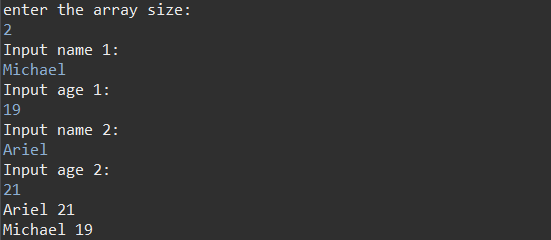

# GSLC OOP - Age Sorter

### This is an age sorter program. Just like its name, the main function of this program is to sort names that are inputted by a user according to their age. First, the program will ask the user to input an integer for determining the size of the array. Next, the user needs to input a list of names and their age. The program will automatically sort the names based on the age and print it out in ascending order.